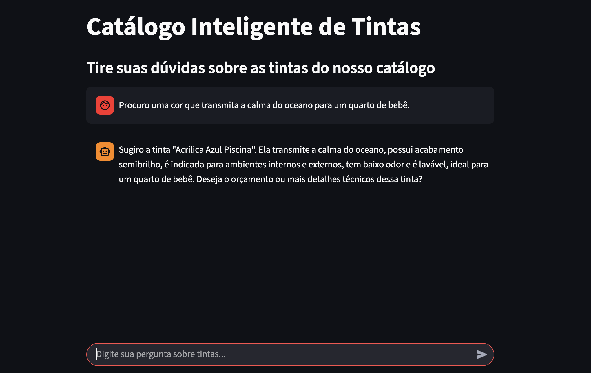
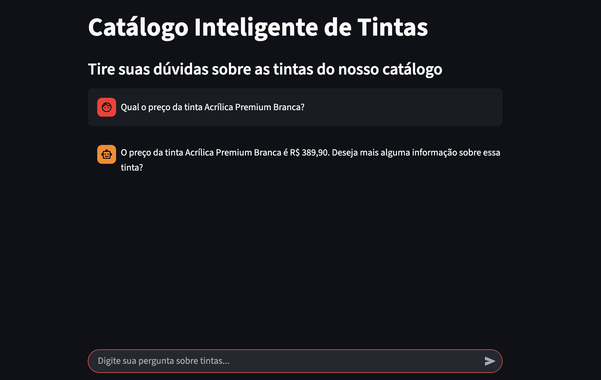
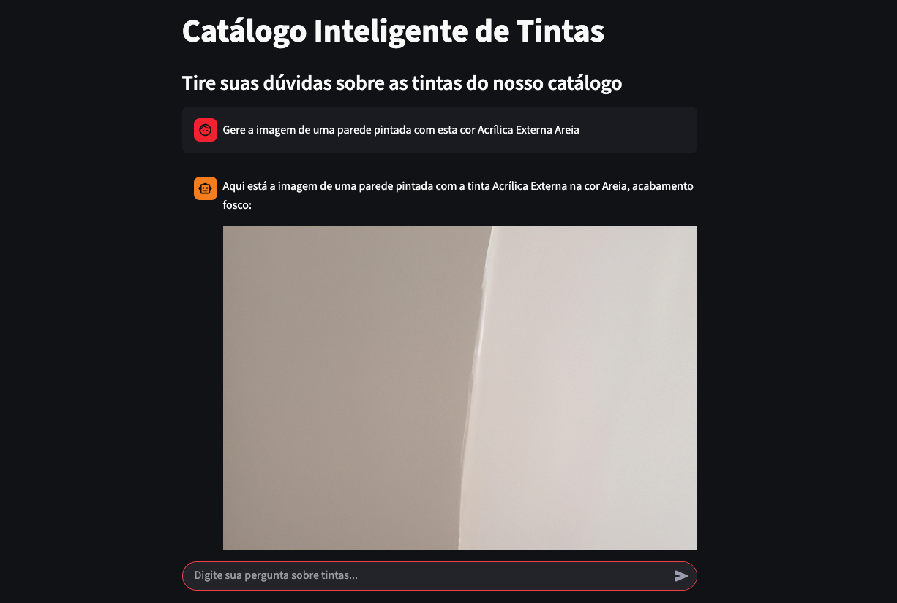

# Catalogo Inteligente de Tintas com IA

Este catálogo inteligente transforma a escolha de cores em uma experiência fluida e interativa. Através de uma interface de chat impulsionada por LLMs, o sistema interpreta as dúvidas dos usuários em tempo real, combinando consultas SQL precisas com busca semântica via embeddings. Além da consultoria técnica, o projeto integra o DALL-E da OpenAI, permitindo que o usuário visualize instantaneamente o resultado final ao gerar imagens realistas da cor aplicada ao ambiente.

---

## 🛠️ Funcionalidades

### 🔐 Segurança e Gestão de Acesso
* **Autenticação JWT:** Implementação robusta de tokens para controle de sessões.
* **RBAC (Role-Based Access Control):** Sistema de permissões por níveis de acesso, garantindo que apenas usuários autorizados gerenciem o catálogo.
* **CRUD de Usuários:** Gerenciamento completo de perfis (Criação, Leitura, Atualização e Deleção).

### 📋 Gestão do Catálogo de Tintas
* **Controle de Registros:** Funcionalidades para criação, listagem detalhada e exclusão de tintas no banco de dados.
* **Imutabilidade de Dados:** Design focado em integridade, operando com fluxo de inserção e remoção (sem edição de registros legados).

### 🤖 Inteligência Artificial & Busca Híbrida
* **Agente com Function Calling (Tools):** O assistente de chat utiliza ferramentas automatizadas para decidir como buscar a informação solicitada pelo usuário.
* **Busca Semântica:** Localização de tintas por contexto e similaridade através de comparação de **embeddings**.
* **Consultas SQL Dinâmicas:** Recuperação de dados estruturados em tempo real para informações técnicas e precisas do banco de dados.
* **Geração de Imagens com DALL-E:** Integração com o modelo da OpenAI para gerar prévias visuais de como as cores selecionadas ficariam aplicadas em uma parede.

---

## 🏗️ Arquitetura e Tecnologias

O projeto foi construído utilizando uma stack moderna e escalável, focada em performance e integração de IA:

* **Linguagem:** Python
* **Framework Web:** FastAPI (construção de APIs de alta performance com tipagem e validação de dados).
* **Orquestração de IA:** LangChain (gerenciamento do agente, memória e integração de ferramentas/tools).
* **Modelos de Linguagem (LLMs):** 
    * **gpt-4.1-mini:** Cérebro do agente para processamento de linguagem e tomada de decisão.
    * **dall-e-3:** Geração de imagens para simulação visual de ambientes.
    * **text-embedding-3-small:** Geração de vetores de alta performance para busca semântica.
* **Banco de Dados:** PostgreSQL (armazenamento de dados relacionais e vetoriais).
* **Infraestrutura & Containerização:** * Docker & Docker Compose (padronização do ambiente de desenvolvimento e facilidade no deploy).

---

### 🔍 Observabilidade com LangSmith

O projeto utiliza o **LangSmith** para monitoramento e depuração (debugging) em tempo real de toda a cadeia de pensamento do Agente. Com isso, é possível:

* **Rastreamento de Traces:** Visualizar cada etapa do raciocínio da IA, desde a entrada do usuário até a chamada de ferramentas (*tools*).
* **Análise de Custos e Latência:** Monitorar o consumo de tokens e o tempo de resposta de cada consulta aos modelos da OpenAI.
* **Depuração de Prompts:** Identificar exatamente onde o Agente pode ter falhado ao decidir entre uma busca SQL ou uma busca Semântica.

---

## 🕹️ Como Utilizar

### 1. Pré-requisitos
Antes de começar, você precisará ter instalado:
* **Docker** e **Docker Compose**
* Uma conta na **OpenAI** com uma chave de API ativa.

## 📥 Instalação e Setup

Siga os passos abaixo para clonar o repositório e configurar o ambiente de desenvolvimento em sua máquina local.

### 2. Clonar o Repositório
Abra o terminal e execute o comando para baixar o projeto:

```bash
# Clonar projeto
git clone https://github.com/GuiKrause/Catalogo-Inteligente-de-Tintas-com-IA.git

# Entrar na pasta
cd Catalogo-Inteligente-de-Tintas-com-IA
```

### 3. Configuração do Ambiente (.env)

O projeto é dividido em serviços, cada um com suas responsabilidades e variáveis de ambiente específicas. Crie um arquivo `.env` na raiz ou configure-os individualmente conforme abaixo:

#### 🧠 Agent Service (IA & Orquestração)

Gerencia a lógica do Agente LangChain, ferramentas e processamento de linguagem natural.

```env
OPENAI_API_KEY=<sua_chave_openai>
DATABASE_URL=postgresql://user:pass@db:5432/paint_db
AGENT_MODEL=gpt-4.1-mini
EMBEDDINGS_MODEL=text-embedding-3-small
PROJECT_NAME=<nome_do_projeto>
DEBUG=True
LANGSMITH_TRACING=True
LANGSMITH_ENDPOINT=<langsmith_endpoint>
LANGSMITH_API_KEY=<sua_chave_langsmith>
LANGSMITH_PROJECT=<nome_do_projeto>
```

#### 💾 CRUD Service (Gestão e Segurança)

Responsável pela persistência de dados no PostgreSQL, controle de acesso RBAC, geração de tokens JWT e processamento de embeddings.

```env
OPENAI_API_KEY=sua_chave_openai
DATABASE_URL=postgresql://user:pass@db:5432/paint_db
SECRET_KEY=secret_key
ALGORITHM=HS256
ACCESS_TOKEN_EXPIRE_MINUTES=30
EMBEDDINGS_MODEL=text-embedding-3-small
```

#### 💻 Frontend (Interface do Usuário)

Variável necessária para que a interface cliente consiga localizar e se comunicar com o serviço do Agente.

```env
AGENT_API_URL=http://localhost:8000
```

## 4. Como Executar com Docker 🐳

Este projeto utiliza o **Docker Compose** para gerenciar os três serviços (**Agent**, **CRUD** e **Frontend**) de forma integrada, facilitando a comunicação entre eles e o banco de dados.

### Construir e Iniciar os Serviços
Para baixar as imagens necessárias e iniciar todos os containers pela primeira vez, utilize o comando abaixo:

```bash
# O parâmetro --build garante que as imagens sejam reconstruídas com as alterações recentes
docker-compose up --build
```

---

## 🗨️ Guia de Utilização e Exemplos

A interação com o catálogo ocorre através de um chat inteligente. O Agente de IA decide, com base na sua frase, se deve consultar o banco de dados técnico, realizar uma busca por "sentimento/contexto" ou gerar uma visualização.

### 1. Consultas ao Catálogo (Chat IA)

O Agente utiliza **Busca Híbrida** para responder. Experimente prompts como:

* **Busca Semântica (Contexto):** 
    > "Procuro uma cor que transmita a calma do oceano para um quarto de bebê."

    *O agente usará o tool `get_semantic_search_tool` para encontrar cores relaxantes e tons de azul/verde.*

    

* **Busca Técnica (SQL Tool):** 
    > "Qual o preço da tinta Acrílica Premium Branca?"

    *O agente gerará uma query SQL para filtrar preço da tinta*

    

---

### 2. Visualização de Ambientes (DALL-E)

Se você encontrou uma cor mas tem dúvida de como ela ficaria na parede, peça ao assistente para gerar uma simulação:

* **Exemplo de Prompt:**
    > "Gere a imagem de uma parede pintada com esta cor Acrílica Externa Areia."

    *O agente gerará uma imagem de uma parede com a cor solicitada*

    

---

### 3. Gestão Administrativa e RBAC (Role-Based Access Control)

Para operações de escrita e modificação de dados, o sistema implementa uma camada de segurança que valida o token **JWT** e o nível de acesso (**Role**) do usuário.

* **Administradores:** Possuem acesso total ao `crud-service`, podendo cadastrar novas tintas, gerenciar o inventário e remover itens do catálogo.
* **Usuários:** Possuem permissões de *Read-Only* (apenas leitura) para consultas e acesso às ferramentas de geração de imagens via IA.

---

## 🧪 Testando via Swagger UI

O projeto utiliza a documentação automática do FastAPI. Para testar os endpoints protegidos, siga este fluxo obrigatório de autenticação:

1. **Criar uma Conta:**
   * Acesse `http://localhost:8001/docs`.
   * Localize a rota `POST /auth/register`.
   * Clique em **"Try it out"**, preencha seus dados (e-mail, senha e role) e execute para criar seu usuário.

2. **Obter o Token de Acesso:**
   * Vá até a rota `POST /auth/token`.
   * Informe suas credenciais cadastradas. O sistema retornará um `access_token`.
   * Copie este token (sem as aspas).

3. **Autorizar no Sistema:**
   * No topo da página do Swagger, clique no botão **"Authorize"** (ícone de cadeado).
   * No campo que abrir, insira suas credenciais e o token obtido.
   * Clique em **"Authorize"** e depois em **"Close"**.


*Interface do Swagger onde é realizado o registro e a obtenção do token JWT para acesso às rotas de IA e CRUD.*

---

### 🔑 Resumo do Fluxo de Autenticação
| Passo | Rota | Ação |
| :--- | :--- | :--- |
| **1** | `auth/register` | Criação de novo usuário (User/Admin) |
| **2** | `auth/token` | Login e geração do Token JWT |
| **3** | **Authorize** | Inserção do Token para liberar os endpoints protegidos |

---

## 🚀 Próximos Passos e Melhorias Futuras

O projeto encontra-se em constante evolução, com foco em elevar a qualidade técnica e a experiência do usuário.

### 🏗️ Refatoração e Qualidade de Código
* **Estruturação de Arquivos:** Reorganização da arquitetura de diretórios para seguir padrões de mercado mais rigorosos, facilitando a escalabilidade.
* **Aplicação de Clean Code:** Refatoração contínua das funções e classes para garantir um código mais legível, testável e de fácil manutenção.
* **Orientação a Objetos (POO):** Aprofundamento do uso de padrões de projeto e abstrações de classes para desacoplar as responsabilidades entre os serviços.

### ♾️ DevOps e Infraestrutura
* **Pipeline CI/CD:** Implementação de fluxos automatizados (GitHub Actions) para execução de testes unitários e linting a cada pull request.
* **Observabilidade:** Integração com ferramentas de monitoramento de logs e métricas.

---

## 👥 Autor

<table>
  <tr>
    <td align="center">
      <a href="https://github.com/GuiKrause">
        
        <br/>
        <sub><b>Guilherme Krause Ramos</b></sub>
      </a>
    </td>
  </tr>
</table>
